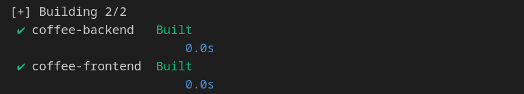
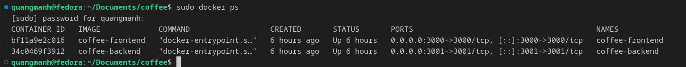
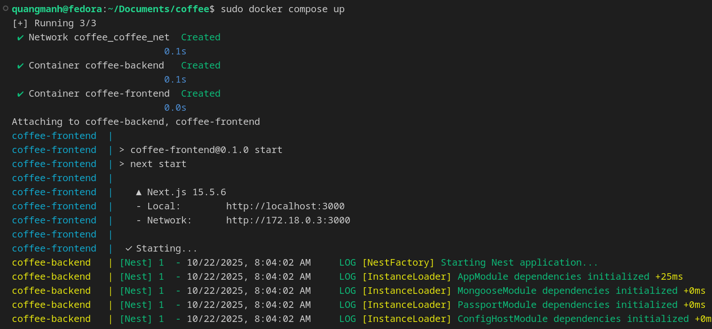
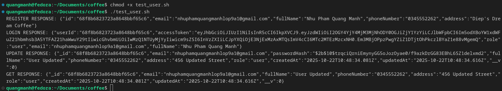
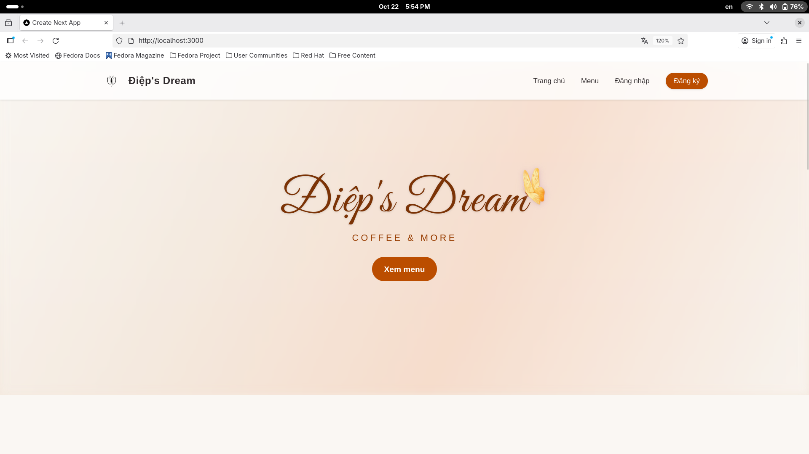
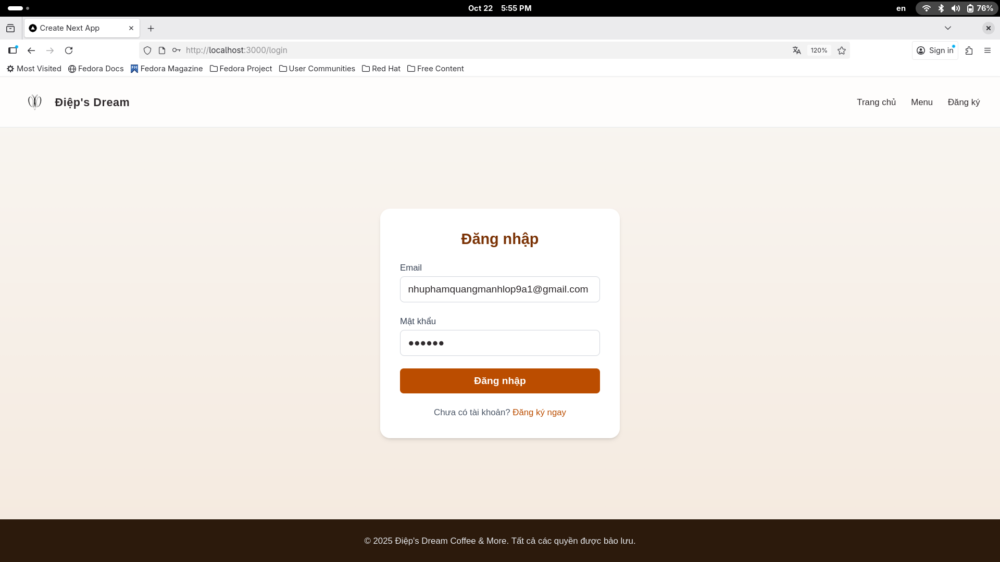
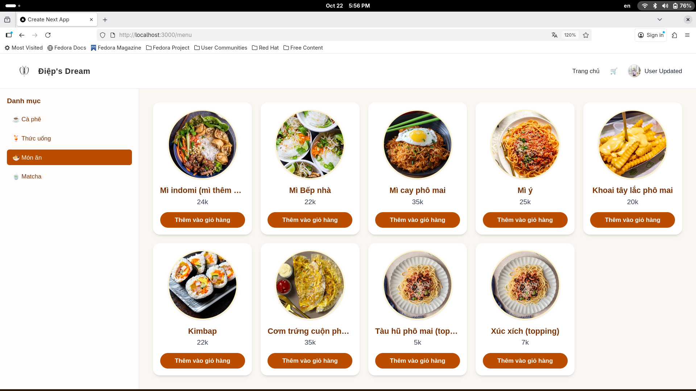

# Bài cáo về nhiệm vụ: Hiểu Devops & Docker hóa dự án backend (UserCRUD)
## 1. Nỗi đau hiện tại khi phát triển và vận hành sản phẩm.
* Khi phát hành thủ công, khi phát triển một phiên bản mới nâng cấp, thường sẽ phải làm thủ công lại nhiều bước như đóng gói, kết nối, cài đặt. Từ đó tạo ra các sai sót, lỗi không mong muốn. Đồng thời khó có thể quay trở lại phiên bản cũ vốn đã ổn định. Đây là khó khăn lớn trong quá trình Operations.
* Sau khi việc Development được hòan thành, mã cần được kiểm thử, chờ đợi rồi mới được đẩy lên. Đôi khi gây trễ tiến độ, trế hẹn tính năng.
* Giám sát một cách quá đơn thuần: chỉ thông qua sự hoạt động của RAM hay CPU mà không biết chậm ở đâu, lỗi thế nào.

    ***-> Từ đó một cách thức tổ chức công việc mang tên là DevOps ra đời để giải quyết các vấn đề trên.***

## 2. Devops là gì?
* DevOps không phải một vai trò. Mà là cách tổ chức làm việc giữa Development và Operations. Nhằm mục đích mọi sự phát triển, thay đổi đi từ ý tưởng tới sản phẩm và tới người dùng mượt mà, trơn tru hơn.
* Tinh thần cốt lõi:
    * Tạo dòng chảy trơn tru: Việc có xu hướng lặp đi lặp lại thì tự động hóa để máy thực hiện, con người tập trung vào việc có giá trị như kiểm soát và đánh giá.
    * Phản hồi sớm: Kiểm tra sớm, phát hiện sớm, sửa các vấn đề sớm hơn.
    * Học và cải thiện liên tục: đo đạc bằng số liệu, sau mỗi sự cố đều phải rút kinh nghiệm để không mắc phải ở những lần thực hiện sau.

    ***-> Và DevOps mang trong mình giải pháp để chấm dứt nỗi đau hiện tại khi phát triển và vận hành sản phẩm gồm 3 trụ cột là CI/CD - Automation - Monitoring/Observability.***
## 3. Giải pháp DevOps 3 trụ cột.
### 3.1 CI/CD - Tự động kiểm tra và đưa phiên bản mới ra.
* CI (Continnuous intergration): Mỗi lần đẩy code lên là máy tự build và chạy kiểm thử. Nếu ổn mới cho phép gộp code.
* CD (Continuous Development): khi đã được thông qua, phiên bản sẵn sàng đưa lên môi trường chạy. Có thể đưa dần một lượng nhỏ user thử nghiệm trước để an tòan.
### 3.2 Automation - Tự động hóa.
* Mọi công việc lặp lại như build - test - cài đặt ... đều được viết thành kịch bản - scripts. Như thế, dù là bất kì ai chạy đều cho ra một kết quả như nhau. Có sự kiểm soát theo kịch bản.
### 3.3 Giám sát - Monitoring/Observability.
* Không chỉ nhìn máy chủ xem CPU RAM mà còn đo đạc theo trải nghiệm. đỗ trễ trả lời, lượng truy cập, tỉ lệ lỗi. Đặt ngưỡng để cảnh báo (ví dụ: 95% yêu cầu trả lời dưới 300ms; tỉ lệ lỗi dưới 0.1%).
### 3.4 Lợi ích cụ thể của 3 trụ cột giải pháp mang lại.
* Lợi ích đầu tiên chính là ra phiên bản một cách thường xuyên bất kể khi nào muốn nhờ vào CI/CD.
* Giảm lỗi do thao tác bằng tay nhờ vào Automation.
* Nhờ monitoring phát hiện sớm sự cố, xử lý nhanh, đo đạc chính xác nơi cần thiết.
* Dễ quay lại phiên bản trước hơn nhờ việc đóng gói (build) thường xuyên.
* Nhóm phát triển và vận hành có thể phối hợp dễ dàng hơn nhờ cùng sử dụng một quy trình và cùng giám sát hệ thống thông qua dữ liệu thực tế.

***-> Chung quy lại, DevOps thực hiện mục tiêu xây dựng một đường ray tự động. Code cứ đi qua các trạm soát chính là các cổng kiểm tra. An tòan thì đưa lên để gộp và chạy. Nếu có vấn đề thì, quay về phiên bản cũ, không gộp hay chạy code. Đường ray dựa trên 3 trụ cột và cũng chính là giải pháp cho nỗi đau hiện tại khi phát triển và vận hành sản phẩm.***

* Đường ray được nhắc đến ở phần kết luận trên chính là **quy trình 5 bước: ```Code -> Build -> Test -> Deploy -> Monitor```.**

## 4. Quy trình 5 bước ```Code -> Build -> Test -> Deploy -> Monitor```.
### 4.1 Viết code.
* Thay vi viết code trong 1 tháng và cuối tháng mới gộp code, nên gộp code theo ngày hoặc nhiều lần trong ngày từng ít một theo đúng tinh thần Kiểm tra sớm, phát hiện sớm, sửa các vấn đề sớm hơn.
* Chỉ gộp code khi qua các bước kiểm tra. Tạo nhánh chính sạch tức gộp là hoạt động trơn tru mượt mà.
* Nên xây dựnd công tắc tính năng: code có thể lên sớm, nhưng bật/tắt tính năng theo ý muốn (để thử dần).

***-> Kết quả giúp đỡ kẹt hay ngộp code, giảm xung đột, đều tay.***
### 4.2 Build - Đóng gói.
* Đóng gói ứng dụng thường thành Container và chạy được.
* build một lần trong hệ thống tự động, rồi dùng cùng gói đó cho mọi môi trường. 
* Khóa phiên bản thư viện, framework để sau build lại ra đúng gói giống như cũ.

***-> Kết quả sản phẩm chạy trên nhiều môi trường, dễ tái lập lại khi gặp sự cố.***
### 4.3 Test - kiểm thử.
* Kiểm thử cần nhanh và cũng cần đáng tin cậy, đầy đủ. Gồm các nhóm sau:
    * Kiểm thử đơn vị: kiểm logic với tốc độ nhanh và số lượng lớn.
    * Kiểm thử tích hợp: Kiểm các phần câu nối DB, API.
    * Kiểm thử đầu cuối, Kiểm thử chất lượng mã nguồn, kiểm thử bảo mật thư viện.
* Nếu đạt yêu cầu kiểm thử cho phép các bước tiếp theo.

***->Kết quả là lỗi được bắt trước khi chạm bước deploy.***

### 4.4 Deploy - Triển khai.
* Tự động đưa lên các môi trường để xem chúng hoạt động không, API thế nào.
* Thử nghiệm với số lượng bé người dùng. Có hai hướng là khu song song và khu nhóm nhỏ. 
    * Hai khu chạy song song: chuẩn bị khu mới bên cạnh khu đang chạy. Khi ổn thì chuyển hướng người dùng sang khu mới. Nếu có vấn đề, đảo chiều để quay lại khu cũ.
    * Thử trên nhóm nhỏ: lúc đầu chỉ cho 1% người dùng dùng phiên bản mới, nếu ổn thì tăng lên 5%, 25%, rồi 100%. Nếu chỉ số xấu đi, ngưng lại và quay về phiên bản trước.
* Dùng nút bấm hoặc một lệch để deploy theo kịch bản. Không rời rạc thao tác.

***-> Kết quả là ra phiên bản an toàn, hạn chế rủi ro tốt, quay lại nhanh khi cần.***

### 4.5 Monitor - Giám sát
* Lập Dashboard theo dõi thứ cần thiết mà chính người dùng cảm nhận rõ như độ trễ, lượng truy cập ... 
* Đặt ngưỡng để cảnh báo.
* Sau mỗi lần có vấn đề, viết bản rút kinh nghiệm: nguyên nhân, bài học, sửa vào quy trình/pipeline để lần sau tránh lặp lại.

***-> Kết quả là biết sớm sửa sớm, số liệu nói chuyện, số liệu đánh giá, số liệu là bài học.***

## 5. Tổng kết.
* DevOps giúp nhóm vừa nhanh vừa chắc:
    * Tự động hoá toàn bộ đường đi của code.
    * Phát hành nhỏ, đều, dễ kiểm soát.
    * Biết rõ tình trạng hệ thống.
    * Khi có lỗi, quay lại trạng thái ổn định chỉ trong vài phút.

**Áp dụng DevOps là bước tiến tất yếu để mọi nhóm phát triển hiện đại rút ngắn khoảng cách giữa code xong và triển khai sản phẩm tới người dùng, nhanh mà ổn định và an tòan.**

## 6. Ứng dụng minh họa cho CRUD (User).
* Với sự gợi ý từ một người quen, đồng thời cần một dự án để chuẩn bị cho một dự án DeOps, em đang làm một trang đặt đơn coffee. Trước hết là cho nhiệm vụ này với phần trình bày về `User` (CRUD). Ngoài ra còn có Thực đơn (`Menu`), Giỏ hàng (`Cart`), Phân quyền và Xác Thực (`Auth`), Đặt đơn (`Order`). 

* Dự án coffee với hai phân BE và FE (**Thực hiện hóa ý tưởng, bố cục, chức năng nút và css dưới sự hỗ trợ của GPT**) có cấu trúc như mục cơ bản như sau:
```
coffee/
├── docker-compose.yml                # Quản lý multi-service stack 
│
├── coffee-backend/
│   ├── Dockerfile                    # Dockerfile cho NestJS backend
│   ├── package.json
│   ├── tsconfig.json
│   ├── .env                          # Env file chứa MONGO_URI, JWT_SECRET, PORT
│   ├── src/
│   │   ├── main.ts                   # Entry point của ứng dụng NestJS
│   │   ├── app.module.ts             # Module gốc, import toàn bộ module con
│   │   │
│   │   ├── config/
│   │   │   └── database.config.ts    # Cấu hình Mongoose (connect tới MongoDB)
│   │   │
│   │   ├── modules/
│   │   │   ├── auth/                 # Xác thực người dùng (JWT, guard, roles)
│   │   │   ├── users/                # CRUD người dùng
│   │   │   ├── menu/                 # CRUD món trong menu - Đây là thứ được trình bày.
│   │   │   ├── cart/                 # Giỏ hàng người dùng
│   │   │   └── orders/               # Đơn hàng & quản lý trạng thái
│   │   │
│   │   └── scripts/
│   │       └── seedAdmin.ts          # Script tạo tài khoản admin mặc định
│   │
│   └── README.md
│
├── coffee-frontend/
│   ├── Dockerfile                    # Dockerfile cho Next.js frontend
│   ├── package.json
│   ├── next.config.mjs
│   ├── public/
│   │   └── images/                   # Ảnh banner, logo, sản phẩm
│   └── src/
│       ├── app/
│       │   ├── page.tsx              # Trang Home
│       │   ├── login/page.tsx        # Trang đăng nhập
│       │   ├── register/page.tsx     # Trang đăng ký
│       │   ├── menu/page.tsx         # Danh sách món, thêm vào giỏ
│       │   ├── cart/page.tsx         # Giỏ hàng + checkout
│       │   ├── profile/page.tsx      # Hồ sơ người dùng
│       │   ├── admin/page.tsx        # Quản trị menu & đơn hàng
│       │   └── components/
│       │       └── UserMenu.tsx      # Dropdown user info / logout
│       └── styles/
│           └── globals.css        
│
└── README.md                         # Tài liệu hướng dẫn build & deploy

```
### **Trong đó, module User gồm 5 file:**
* `user.dto.ts`: 
    * Hai lớp `LoginUserDto` và `RegisterUserDto` định nghĩa cấu trúc dữ liệu khi người dùng gửi yêu cầu đăng nhập và đăng ký.
    * Chúng sử dụng `class-validator` để kiểm tra tính hợp lệ của đầu vào, giúp hệ thống ổn định và tránh lỗi runtime.
```
import { IsEmail, IsNotEmpty, IsString, Matches, MinLength } from "class-validator";

export class LoginUserDto {
  @IsEmail({}, { message: "Email không hợp lệ." })
  email: string;

  @IsNotEmpty({ message: "Mật khẩu không được để trống." })
  password: string;
}

export class RegisterUserDto {
  @IsEmail({}, { message: "Email không hợp lệ." })
  email: string;

  @IsNotEmpty({ message: "Mật khẩu không được để trống." })
  @MinLength(6, { message: "Mật khẩu phải có ít nhất 6 ký tự." })
  password: string;

  @IsNotEmpty({ message: "Họ và tên không được để trống." })
  @IsString({ message: "Họ và tên phải là chuỗi ký tự." })
  fullName: string;

  @IsNotEmpty({ message: "Số điện thoại không được để trống." })
  @Matches(/^(0|\+84)[0-9]{9,10}$/, {
    message: "Số điện thoại không hợp lệ. VD: 0901234567 hoặc +84901234567.",
  })
  phoneNumber: string;

  @IsNotEmpty({ message: "Địa chỉ không được để trống." })
  @IsString({ message: "Địa chỉ phải là chuỗi ký tự." })
  address: string;
}
```
* `users.schema.ts`: Schema này định nghĩa mô hình `User` trong MongoDB với các ràng buộc cần thiết điển hình như:
    * `email` phải duy nhất và bắt buộc.
    * `passwordHash` lưu mật khẩu đã mã hóa.
    * `role` mặc định là `user`, có thể gán `admin` cho tài khoản quản trị.
```
import { Prop, Schema, SchemaFactory } from "@nestjs/mongoose";
import { Document } from "mongoose";

export type UserDocument = User & Document & {_id: string};
@Schema({timestamps: true})
export class User {
    @Prop({required: true, unique: true})
    email: string;

    @Prop({required: true})
    passwordHash: string;

    @Prop({required: true})
    fullName: string;

    @Prop({required: true})
    phoneNumber: string;

    @Prop({required: true})
    address: string;

    @Prop({ default: 'user', enum: ['user', 'admin'] })
    role: string;
}

export const UserSchema =  SchemaFactory.createForClass(User);
```

* `users.service.ts`: 
    * Chịu trách nhiệm quản lý toàn bộ nghiệp vụ người dùng, bao gồm: đăng ký, đăng nhập, cập nhật thông tin, tìm kiếm và xóa tài khoản.
Dịch vụ này làm việc trực tiếp với MongoDB thông qua `Mongoose`, đồng thời sử dụng `AuthService` để sinh token JWT.
```
import { BadRequestException, Injectable } from "@nestjs/common";
import { UnauthorizedException } from "@nestjs/common";
import { InjectModel } from "@nestjs/mongoose";
import { Model } from "mongoose";
import * as bcrypt from "bcrypt";
import { User, UserDocument } from "./users.schema";
import { AuthService } from "../auth/auth.service";
import { NotFoundException } from "@nestjs/common";

@Injectable()
export class UserService{
    constructor(@InjectModel(User.name) private userModel: Model<UserDocument>, private authService: AuthService) {}
    async register(email: string, password: string, fullName: string, phoneNumber: string, address: string): Promise<UserDocument> {
        const passwordHash = await bcrypt.hash(password, 10);
        const user = new this.userModel({email, passwordHash, fullName, phoneNumber, address});
        try {
            return await user.save();
        } catch (e: any){
            if (e.code === 11000) {
                throw new BadRequestException("Email đã được đăng ký trước đó");
            }
            throw e;  
        }
    }

    async login(email: string, password: string){
        const user = await this.userModel.findOne({email}).exec();
        if (!user || !(await bcrypt.compare(password, user.passwordHash))) {
            throw new UnauthorizedException("Email hoặc mật khẩu không chính xác");
        }

        const token = this.authService.generateToken({id: user._id.toString(), email: user.email, phone: user.phoneNumber, role: user.role});
        return {id: user._id.toString(), email: user.email, fullName: user.fullName, phoneNumber: user.phoneNumber, address: user.address, accessToken: token, role: user.role}
    }

    async deleteUser(id: string){
        return this.userModel.findByIdAndDelete(id);
    }

    async updateInfo(id: string, data: Partial<User>){
        if (data["password"]) {
        const passwordHash = await bcrypt.hash(data["password"], 10);
        data["passwordHash"] = passwordHash;
        delete data["password"];
        }

        const updated = await this.userModel.findByIdAndUpdate(id, data, { new: true });
        if (!updated) throw new NotFoundException("Không tìm thấy người dùng để cập nhật");
        return updated;
    }

    async findByEmail(email: string) {
        const user = await this.userModel.findOne({ email }).select("-passwordHash");
        if (!user) throw new NotFoundException("Không tìm thấy người dùng với email này");
        return user;
    }

    async findByPhone(phoneNumber: string) {
        const user = await this.userModel.findOne({ phoneNumber }).select("-passwordHash");
        if (!user) throw new NotFoundException("Không tìm thấy người dùng với số điện thoại này");
        return user;
    }
}
```

* `users.controller.ts`: 
    * Controller này định nghĩa các endpoint chính cho nghiệp vụ người dùng — nơi frontend gửi yêu cầu RESTful tới.
    Nó liên kết với `UserService`, `AuthService`, và `CartService` để thực hiện đăng ký, đăng nhập, cập nhật, xóa và tìm kiếm người dùng.
    * Cũng là nơi thể hiện CRUD User trong hệ thống.

        | Hành động  | Endpoint                                                           | HTTP Method | Mô tả ngắn                         |
        | ---------- | ------------------------------------------------------------------ | ----------- | ---------------------------------- |
        | **Create** | `/users/register`                                                  | POST        | Tạo tài khoản người dùng mới       |
        | **Read**   | `/users/login`, `/users/email/:email`, `/users/phone/:phoneNumber` | POST / GET  | Đăng nhập hoặc truy vấn người dùng |
        | **Update** | `/users/:id`                                                       | PUT         | Cập nhật thông tin người dùng      |
        | **Delete** | `/users/:id`                                                       | DELETE      | Xóa người dùng khỏi hệ thống       |


```
import { Controller, Post, Body, BadRequestException, Delete, Param, Put, Get } from "@nestjs/common";
import { RegisterUserDto, LoginUserDto } from "./users.dto";
import { UserService } from "./users.service";
import { AuthService } from "../auth/auth.service";
import { CartService } from "../cart/cart.service";


@Controller('users')
export class UserController {
  constructor(private readonly userService: UserService,
    private readonly authService: AuthService,
    private readonly cartService: CartService
  ) {}
  @Post('register')
  async register(@Body() dto: RegisterUserDto) {
    const user  = await this.userService.register(dto.email, dto.password, dto.fullName, dto.phoneNumber, dto.address);
    await this.cartService.ensureCart(user._id);
    return { id: user._id, email: user.email, fullName: user.fullName, phoneNumber: user.phoneNumber, address: user.address };
  }

  @Post('login')
  async login(@Body() dto: LoginUserDto) {
    try {
      const user = await this.userService.login(dto.email, dto.password);
      return { userId: user.id, accessToken: user.accessToken, role: user.role, email: user.email, fullName: user.fullName};
    } catch (e) {
      throw new BadRequestException(e.message);
    }
  }
  @Delete(':id')
  async deleteUser(@Param("id") id: string){
    return this.userService.deleteUser(id);
  }

  @Put(':id')
  async updateUser(@Param("id") id: string, @Body() body: any){
    return this.userService.updateInfo(id, body);
  }

  @Get("email/:email")
    async findByEmail(@Param("email") email: string) {
      return this.userService.findByEmail(email);
  }

  @Get("phone/:phoneNumber")
    async findByPhone(@Param("phoneNumber") phoneNumber: string) {
      return this.userService.findByPhone(phoneNumber);
  }
}
```

* `users.module.ts`: 
    * là module đóng gói toàn bộ nghiệp vụ của người dùng, bao gồm controller, service, schema và các module phụ trợ như `AuthModule` (xác thực JWT) và `CartModule` (khởi tạo giỏ hàng).
```
import { Module } from "@nestjs/common";
import { UserController } from "./users.controller";
import { UserService } from "./users.service";
import { MongooseModule } from "@nestjs/mongoose";
import { User, UserSchema } from "./users.schema";
import { AuthModule } from "../auth/auth.module";
import { CartModule } from "../cart/cart.module";

@Module({
    imports: [MongooseModule.forFeature([{name: User.name, schema: UserSchema}]), AuthModule, CartModule],
    providers: [UserService],
    controllers: [UserController],
    exports: [UserService]
})
export class UserModule {}
```

### **Đó là những nội dung quan trọng thể hiện trong `user`, ngoài ra `cart`, `menu` ... hay `app.module.ts`, `main.ts` hay `.env` được luư trong repo github sau:**
### https://github.com/QuangManhAI/Diep-s-Dream

## 7. Container hóa dự án.
* Như vậy ở đây em xin phép sẽ container hóa BE và FE cho dự án coffee shop. Thử CRUD `user` bằng một scripts `.bash` và cả giao diện Fontend.

### 7.1 Dockerfile cho BE.
```
FROM node:20-alpine AS builder
WORKDIR /app
COPY package*.json ./
RUN npm install --legacy-peer-deps
COPY . .
RUN npm run build

FROM node:20-alpine
WORKDIR /app
COPY --from=builder /app/dist ./dist
COPY package*.json ./
RUN npm install --omit=dev
COPY .env .env
EXPOSE 3001
CMD ["node", "dist/main.js"]
```
### 7.2 Dockerfile cho FE.
```
FROM node:20-alpine AS builder
WORKDIR /app
COPY package*.json ./
RUN npm install --legacy-peer-deps
COPY . .
RUN npm run build

FROM node:20-alpine
WORKDIR /app
COPY --from=builder /app/.next ./.next
COPY --from=builder /app/public ./public
COPY package*.json ./
RUN npm install --omit=dev
EXPOSE 3000
CMD ["npm", "run", "start"]
```
### 7.3 Docker Compose để quản lý nhiều container(BE và FE).
```
services:
  backend:
    build: ./coffee-backend
    container_name: coffee-backend
    ports:
      - "3001:3001"
    env_file:
      - ./coffee-backend/.env
    networks:
      - coffee_net

  frontend:
    build:
      context: ./coffee-frontend
      args:
        NEXT_PUBLIC_API_URL: http://backend:3001   
    container_name: coffee-frontend
    ports:
      - "3000:3000"
    environment:
      - NEXT_PUBLIC_API_URL=http://backend:3001   
    depends_on:
      - backend
    networks:
      - coffee_net

networks:
  coffee_net:
    driver: bridge
```
### 7.4 Bulid and Up
* Sau khi có Dockerfile và docker-compose.yml thì chạy lệnh bash shell.

    ```
    sudo docker compose bulid
    ```
* Build thành công sẽ có log như sau:

    
* Kiểm tra bằng lệnh:
    ```
    sudo docker ps
    ```

    

* Up bằng lệnh sau để tự động build image (từ Dockerfile trong mỗi thư mục) rồi tạo container tương ứng để chạy image đó.
    ```
    sudo docker compose up
    ```
    
* Sau đó viết một script để test CRUD - tạm trừ Delete ra không nó mất trong Database. 
    * tạo file `test_user.sh`.
    * dùng `cd /` di tới thư mục chứa file và dùng lệnh `chmod +x test_user.sh` và chạy với lệnh `./test_user.sh`
    * email: nhuphamquangmanhlop9a1@gmail.com
    * password: 200406
    * role: user(mặc định)

        ```
        #!/bin/bash
        BASE_URL="http://localhost:3001/users"
        EMAIL="nhuphamquangmanhlop9a1@gmail.com"
        PASS="200406"

        REGISTER_RESPONSE=$(curl -s -X POST "$BASE_URL/register" \
        -H "Content-Type: application/json" \
        -d @- <<JSON
        {
        "email": "$EMAIL",
        "password": "$PASS",
        "fullName": "Nhu Pham Quang Manh",
        "phoneNumber": "0345552262",
        "address": "Diep's Dream Coffee"
        }
        JSON
        )
        USER_ID=$(echo "$REGISTER_RESPONSE" | grep -oE '"id":"[^"]+' | cut -d'"' -f4)

        LOGIN_RESPONSE=$(curl -s -X POST "$BASE_URL/login" \
        -H "Content-Type: application/json" \
        -d @- <<JSON
        {"email":"$EMAIL","password":"$PASS"}
        JSON
        )
        ACCESS_TOKEN=$(echo "$LOGIN_RESPONSE" | grep -oE '"accessToken":"[^"]+' | cut -d'"' -f4)

        UPDATE_RESPONSE=$(curl -s -X PUT "$BASE_URL/$USER_ID" \
        -H "Content-Type: application/json" \
        -d @- <<JSON
        {"fullName":"User Updated","address":"456 Updated Street"}
        JSON
        )

        GET_RESPONSE=$(curl -s -X GET "$BASE_URL/email/$EMAIL")

        echo "REGISTER RESPONSE: $REGISTER_RESPONSE"
        echo "LOGIN RESPONSE: $LOGIN_RESPONSE"
        echo "UPDATE RESPONSE: $UPDATE_RESPONSE"
        echo "GET RESPONSE: $GET_RESPONSE"
        ```

        
* Kết quả trong DB:
    ```
            {
            "email": "nhuphamquangmanhlop9a1@gmail.com",
            "passwordHash": "$2b$10$trqciQrniEmynyGG5oJozOyae0/f9azkDrGG83EBhL6SZ1delxmd2",
            "fullName": "User Updated",
            "phoneNumber": "0345552262",
            "address": "456 Updated Street",
            "role": "user",
            "createdAt": {
                "$date": "2025-10-22T10:48:34.081Z"
            },
            "updatedAt": {
                "$date": "2025-10-22T10:48:34.616Z"
            },
            "__v": 0
            }
    ```

* Đăng nhập thử trên FE:
    * Trang chủ -> bấm đăng nhập:

        
    
    * Nhập thông tin đúng email và mật khẩu:

        

    * Thành công vào trong Menu:

        

## 8. Bài báo về CI/CD cho Machine Learning

### 8.1 Tiêu đề bài báo và tổng quan giới thiệu

#### **A Review on Continuous Integration and Continuous Deployment (CI/CD) for Machine Learning** – *Ankur Mahida*

Học máy (Machine Learning – ML) đang đóng vai trò quan trọng trong nhiều lĩnh vực như y tế, tài chính, bán lẻ và giao thông vận tải. Tuy nhiên, việc phát triển và triển khai các mô hình ML phức tạp hơn nhiều so với phần mềm truyền thống do phải xử lý luồng dữ liệu lớn, huấn luyện mô hình lặp lại và liên tục giám sát, cập nhật. Một dự án ML có chu trình khép kín từ xử lý dữ liệu đến huấn luyện và đánh giá, vì vậy CI/CD có thể được xem như một giải pháp tiềm năng giúp tự động hóa toàn bộ vòng đời mô hình, tăng cường hợp tác, rút ngắn chu kỳ phát hành và nâng cao chất lượng mô hình trong môi trường sản xuất.

Một số vấn đề cố hữu trong phát triển ML:

* **Tiền xử lý dữ liệu và kỹ thuật đặc trưng:** dữ liệu thô thường nhiễu, thiếu hoặc không nhất quán, cần quy trình làm sạch và chọn đặc trưng đáng tin cậy.
* **Huấn luyện và đánh giá:** các mô hình lớn (như mạng nơ-ron sâu) tốn thời gian, tài nguyên và cần thử nhiều cấu hình, siêu tham số.
* **Hợp tác và kiểm soát phiên bản:** nhiều nhóm như nhà khoa học dữ liệu, kỹ sư và chuyên gia miền cần phối hợp chặt chẽ khi quản lý mã, dữ liệu và mô hình.

**-> Các phương pháp phát triển phần mềm truyền thống không còn đủ; cần CI/CD để tự động hóa và kết nối các khâu.**

### 8.2 Giải pháp được đề xuất

CI/CD mang đến quy trình tự động hóa toàn diện cho ML:

* **Tiền xử lý và đặc trưng:** tạo pipeline tự động để làm sạch, chuẩn hóa và chọn đặc trưng, giảm lỗi và đảm bảo nhất quán.
* **Huấn luyện và đánh giá:** pipeline CI/CD tự động huấn luyện lại khi có thay đổi mã hoặc dữ liệu, hỗ trợ tìm kiếm siêu tham số và đánh giá mô hình tự động.
* **Triển khai và giám sát:** mô hình được triển khai tự động qua các môi trường staging và production; tích hợp giám sát drift và cảnh báo tái huấn luyện.
* **Hợp tác và kiểm soát phiên bản:** kết hợp Git giúp theo dõi mã, dữ liệu, mô hình, tăng khả năng cộng tác và tái hiện kết quả.

### 8.3 Ứng dụng và tác động

Việc áp dụng CI/CD vào quy trình phát triển ML mang lại nhiều lợi ích rõ rệt:

1. **Rút ngắn thời gian ra thị trường:** quy trình build, train và deploy tự động giảm đáng kể thời gian phát hành.
2. **Cải thiện hợp tác:** nhờ kiểm soát phiên bản và lưu trữ tập trung.
3. **Tăng chất lượng và độ tin cậy:** kiểm thử tự động giúp phát hiện lỗi sớm.
4. **Mở rộng và tái tạo:** pipeline có thể chạy song song, tái tạo trên nhiều môi trường và bộ dữ liệu.
5. **Tối ưu hóa chi phí:** giảm thao tác thủ công, tận dụng hạ tầng hiệu quả, tự động huấn luyện và giám sát.

Nhờ đó, doanh nghiệp đạt hiệu suất cao hơn, sản phẩm ổn định hơn và tạo ra giá trị kinh doanh lớn hơn.

### 8.4 Phạm vi và thực hành tốt nhất

CI/CD bao trùm toàn bộ vòng đời của dự án ML – từ chuẩn bị dữ liệu, huấn luyện, triển khai đến giám sát. Một số thực hành tốt được khuyến nghị:

1. **Tự động hóa pipeline dữ liệu:** đảm bảo tính nhất quán trong tiền xử lý và kỹ thuật đặc trưng.
2. **Container hóa và kiểm soát phiên bản:** sử dụng Docker và Git để duy trì môi trường ổn định và dễ tái tạo.
3. **Tích hợp và kiểm thử liên tục:** phát hiện lỗi sớm trong mã nguồn và mô hình.
4. **Tự động hóa huấn luyện và đánh giá:** cho phép chạy song song nhiều cấu hình và siêu tham số.

Việc áp dụng các phương pháp này giúp tổ chức đạt được quy trình ML ổn định, có thể mở rộng và dễ bảo trì, đồng thời đảm bảo chất lượng mô hình cao và khả năng triển khai linh hoạt trong môi trường thực tế.
